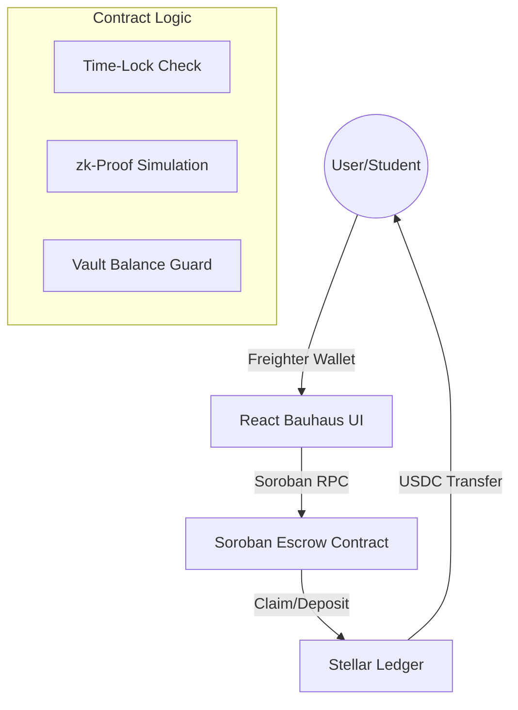

# StipeStream

**One-Line Description:** An automated, time-locked Soroban smart contract that guarantees on-time monthly stipend distributions for university scholars with a premium Bauhaus-inspired interface.


## What is StipeStream?
StipeStream is a decentralized aid disbursement protocol built on the **Stellar Soroban** network. It empowers NGOs, alumni funds, and educational institutions to lock stipends in a smart contract, allowing students to claim their allowance trustlessly and automatically on a strict schedule.

---

## Why Stellar?
- **Low Fees:** Distributing $100 in aid should not cost $10 in network fees. Stellar's fraction-of-a-cent transaction fees ensure the maximum amount of aid reaches the scholar.
- **Soroban Smart Contracts:** Leveraging `Env::ledger().timestamp()` for secure, un-cheatable time-locked conditions.
- **Freighter Wallet:** The industry-standard entry point for the Stellar ecosystem, providing a secure and familiar bridge for users.
- **USDC on Stellar:** Near-instant settlement of stable value, ensuring students receive funds they can use immediately without volatility.

## Design Philosophy: Bauhaus Functionalism
StipeStream is designed around the **Bauhaus Design System**, emphasizing geometric clarity, structural hierarchy, and vibrant primary colors.
- **Crimson (#E63946):** Urgent actions and progress tracking.
- **Navy (#1D4ED8):** Primary identity and student verification status.
- **Gold (#FACC15):** Rewards, treasury volume, and positive impact metrics.
- **Charcoal (#111827):** Deep contrast and professional structural elements.

---

## Key Features

### 1. Smart Contract Time-Locks
Funds are locked in a Soroban escrow. Students can only withdraw their `payout_amount` after a 30-day interval has passed since their last claim. Human intervention is removed, eliminating administrative delays.

### 2. Risk-Free Demo Mode
Explore the entire platform without spending real XLM or having a connected wallet. 
- **Isolated Storage:** Demo actions use separate `localStorage` keys, ensuring your real on-chain data remains untouched.
- **Simulated Transactions:** `executeRealSorobanTx` is bypassed, replacing wallet prompts with mock transaction hashes and realistic network delays.
- **Pre-loaded State:** Instantly populates the dashboard with $12,500 TVL and 15 scholars to show the protocol in an "active" state.
- **Safety First:** A mandatory disclaimer modal ensures users know their real funds are never at risk.

### 3. Persistent Dark Mode
Full support for user-preferred theming. StipeStream remembers your choice between Light and Dark mode, using a premium charcoal palette that preserves the Bauhaus primary colors' vibrancy while reducing eye strain.

### 4. Fully Responsive Engineering
The dashboard is engineered to be a mobile-first experience. 
- **Wrapping Headers:** Navigation and wallet controls wrap logically on small screens.
- **Stacked Layouts:** Complex dashboards transition from multi-column grids to intuitive vertical stacks.
- **Diagram Alignment:** The Fund Allocation flow diagram dynamically re-aligns its connectors for small screens.

---

## Target Users
- **NGOs / Funders:** Organizations requiring transparent, automated disbursement with zero overhead.
- **Scholars (Students):** High-need students relying on predictable, on-time living allowances.
- **Donors:** Individuals who want to see their impact in real-time through the **Impact NFT** visualization.

---

## Architecture



---

## Project Structure
```text
stipestream/
├── contracts/               # Soroban smart contracts
│   └── hello-world/         # Core disbursement logic
│       ├── src/lib.rs       # Rust implementation of escrow & time-locks
├── frontend/                # React Web Application
│   ├── src/
│   │   ├── App.tsx          # Main logic, Demo Mode, & Dashboard routing
│   │   └── index.css        # Bauhaus Design System & Dark Mode variants
│   ├── tailwind.config.js   # Custom Bauhaus design tokens
│   └── screenshot.cjs       # Puppeteer automation for documentation
└── README.md                # Detailed project documentation
```

---

## Status Lifecycle
1. **Unverified:** Student must prove identity (simulated zk-Proof).
2. **Active:** Contract is funded and student is waiting for the timer.
3. **Unlocked:** 30 days have passed; the "Claim" button becomes vibrant red.
4. **Claimed:** Funds transferred; timer resets; on-chain success event triggered.

---

## Contract Functions
- `initialize`: Sets the funder, student, and payout parameters.
- `deposit`: Locks USDC into the contract vault.
- `claim`: Transfers the payout if the 30-day window has closed.

---

## Setup & Quickstart

### Prerequisites
* Rust toolchain (`wasm32-unknown-unknown`)
* Soroban CLI
* Node.js v18+
* Freighter Wallet Extension

### Installation
```bash
git clone https://github.com/PrinceDale99/StripeSpend.git
cd StripeSpend/frontend
npm install
npm run dev
```

### Detailed Deployment
```bash
# 1. Generate and fund a Testnet identity
soroban config identity generate deployer
soroban config identity fund deployer --network testnet

# 2. Build the contract
cd contracts/hello-world
soroban contract build

# 3. Deploy to Testnet
soroban contract deploy \
  --wasm target/wasm32-unknown-unknown/release/stipestream.wasm \
  --source deployer \
  --network testnet
```

### CLI Invocation
You can interact with the live contract directly via CLI:
```bash
soroban contract invoke \
  --id CCSUHUIWD7KLPACAVPROOFMUD6D3GPMEXJVXSRFB52BCVQHREKEH2YCV \
  --source <YOUR_SECRET_KEY> \
  --network testnet \
  -- \
  claim
```

---

## UI Walkthrough

### Home: Establishing Trust
Clearly explains the Web3 value proposition without jargon. Features live treasury stats and the "Built on Stellar" badge.

### Scholar: Claiming stipends
Displays the next unlock timer, available balance, and verification status.

### Sponsor: Funding the future
A one-click deposit interface with the ability to "Onboard New Scholars" and track impact via a dynamic SVG "Impact NFT".

---

## License
MIT License
