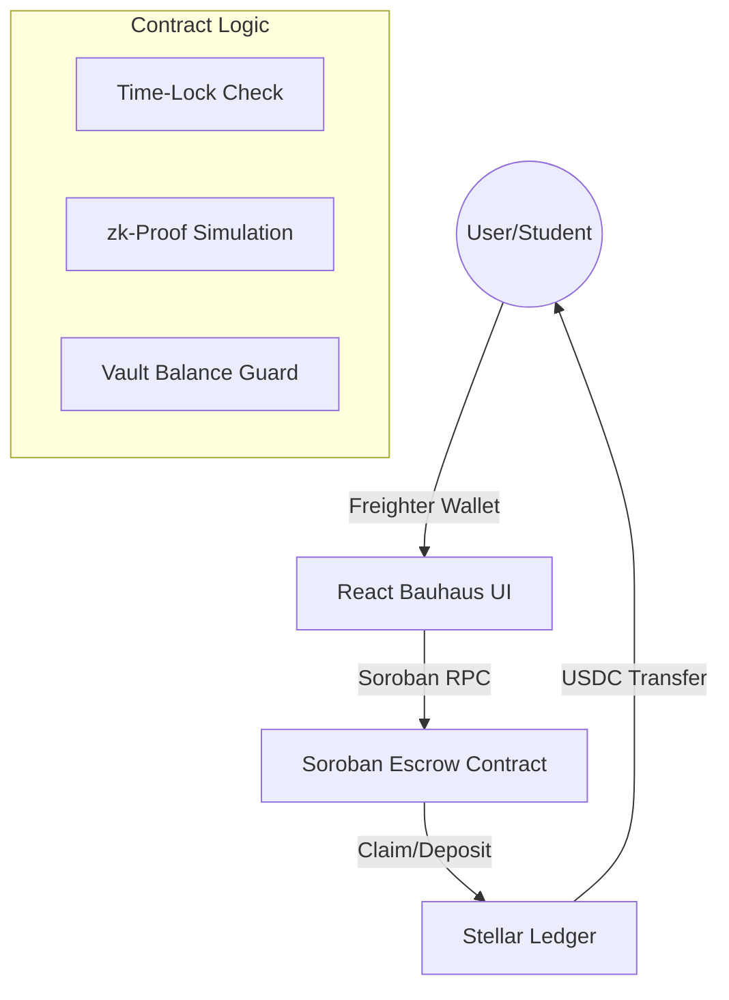

# StipeStream

**One-Line Description:** An automated, time-locked Soroban smart contract for monthly stipend distributions to university scholars using a Bauhaus-inspired interface.


[**Live Website**](https://princedale99.github.io/StipeStream/)

## Live Showcase
[**Demo video link (1-minute) showing full functionality**](./stipestream_showcase.mp4)


## Problem Statement
**The Scenario:** Maria is a senior computer science student. Her monthly allowance from a scholarship NGO is critical for her commute and meals. If the NGO’s accounting faces a delay, her funds are stuck for weeks. 

This delay costs her **₱750 in late rent penalties** and forces her to **skip at least one meal a day** to stretch her remaining cash. With StipeStream, the NGO locks the funds once at the start of the semester, and Maria withdraws her ₱5,000 allowance exactly every 30 days—no administrative delays, no late fees, no skipped meals.

---

## What is StipeStream?
StipeStream is a decentralized aid disbursement protocol built on the **Stellar Soroban** network. It empowers NGOs, alumni funds, and educational institutions to lock stipends in a smart contract, allowing students to claim their allowance automatically on a strict schedule.

---

## Why Stellar?
StipeStream leverages the Stellar network to solve the "last mile" of aid distribution:

| Feature | Use Case in StipeStream |
| :--- | :--- |
| **Soroban Smart Contracts** | Enforces the 30-day time-lock and automatic payout logic. |
| **USDC (Stellar Asset)** | Provides a stable store of value for scholars. |
| **Freighter Wallet** | Handles secure transaction signing for deposits and claims. |
| **Network Ledger** | Provides transparency for NGO treasury audits. |

---

## Key Features

### 1. Smart Contract Time-Locks
Funds are locked in a Soroban escrow. Students can only withdraw their `payout_amount` after a 30-day interval has passed since their last claim. Human intervention is removed, eliminating administrative delays.

### 2. Risk-Free Demo Mode
Explore the platform without spending real XLM or having a connected wallet. 
- **Isolated Storage:** Demo actions use separate `localStorage` keys, ensuring your real on-chain data remains untouched.
- **Simulated Transactions:** `executeRealSorobanTx` is bypassed, replacing wallet prompts with mock transaction hashes.
- **Pre-loaded State:** Instantly populates the dashboard with $12,500 TVL and 15 scholars to show the protocol in an active state.
- **Safety First:** A mandatory disclaimer modal ensures users know their real funds are never at risk.

### 3. Persistent Dark Mode
Full support for user-preferred theming. StipeStream remembers your choice between Light and Dark mode, using a charcoal palette that preserves the Bauhaus design while reducing eye strain.

### 4. Fully Responsive Engineering
The dashboard is engineered to be a mobile-first experience. 
- **Wrapping Headers:** Navigation and wallet controls wrap logically on small screens.
- **Stacked Layouts:** Complex dashboards transition from multi-column grids to intuitive vertical stacks.

---

## Target Users
- **NGOs / Funders:** Organizations requiring transparent, automated disbursement.
- **Scholars (Students):** High-need students relying on predictable, on-time living allowances.
- **Donors:** Individuals who want to see their impact in real-time through the **Impact NFT** visualization.

---

## Architecture



---

## Project Structure
```text
stipestream/
├── contracts/               # Soroban smart contracts
│   └── hello-world/         # Core disbursement logic
│       ├── src/lib.rs       # Rust implementation of escrow & time-locks
├── frontend/                # React Web Application
│   ├── src/
│   │   ├── App.tsx          # Main logic, Demo Mode, & Dashboard routing
│   │   └── index.css        # Bauhaus Design System & Dark Mode variants
│   ├── tailwind.config.js   # Custom Bauhaus design tokens
│   └── screenshot.cjs       # Puppeteer automation for documentation
└── README.md                # Detailed project documentation
```

---

## User Walkthrough
1. **Enter Demo Mode:** Toggle the Demo button in the top right to explore without real funds.
2. **Onboard Scholar:** In the Sponsor Dashboard, check 'Onboard new scholar' and deposit simulated USDC.
3. **Verify Identity:** In the Scholar Dashboard, click 'Verify Student ID' to simulate a zk-Proof KYC check.
4. **Claim Stipend:** Once the 30-day timer expires (or simulated in Demo), click 'Claim USDC' to trigger the distribution.

---

## Smart Contract Details

**Contract ID:** `CCSUHUIWD7KLPACAVPROOFMUD6D3GPMEXJVXSRFB52BCVQHREKEH2YCV`

- **Deployed Smart Contract:** [View on Stellar Lab (Testnet)](https://lab.stellar.org/r/testnet/contract/CCSUHUIWD7KLPACAVPROOFMUD6D3GPMEXJVXSRFB52BCVQHREKEH2YCV)
- **Deployment Transaction:** [View on Stellar Expert](https://stellar.expert/explorer/testnet/tx/67a18357ecf92708f61bd0132823395767bf4df8816802d8404e5f6592004bfd)

### On-Chain Verification
#### Deployment Transaction


#### Deployed Smart Contract


---

## User Validation & Iteration
StipeStream has undergone beta testing with 55 users across Scholars, NGO Admins, Donors, and Registrars.

Detailed feedback and our subsequent design iterations are documented here:
👉 [**Read our Validation Report (VALIDATION.md)**](./VALIDATION.md)

### Feedback Summary
All user responses are collected via a Google Form and exported for analysis:
- 📋 [**Google Form: StipeStream Product Feedback Form**](https://docs.google.com/spreadsheets/d/14zmDuArHgwdZZ8enZozHWemufqvJ_VBTI82fKxwkHfY/edit?usp=sharing)
- 📊 [**Exported Response File (CSV)**](./StipeStream%20Product%20Feedback%20Form%20%28Responses%29%20-%20Form%20Responses%201.csv)

### Verified Testnet Users (55 Total)
All wallets below submitted feedback and are verifiable on [Stellar Expert (Testnet)](https://stellar.expert/explorer/testnet).

| # | Name | Wallet Address |
|---|---|---|
| 1 | Maria Santos | `GBOJN4A72VBGZJMJBJ7P2UVGKERZRVRTDVZ57CGBLVNBW333WSPPZF5E` |
| 2 | David Miller | `GCCPBOUQK45AYSLFBRJPFA7ROM47XQOOB437XCCHBJ4Q5EVZ4GZMGSR4` |
| 3 | Robert Lim | `GCIFITNM7AVIRQLARH7QKVGKXAX62XAGG2QE2JJ6P4WKEEJ3VEP5FFG2` |
| 4 | Sarah Chen | `GDDEFCW2QYPXTZ6MBGUIMYJGNVM4HO3ULCBTHDVQ5ODZLX33WPTEQTL` |
| 5 | Alex Rivera | `GCMX5AJQYZGDSZ6NWEVDUATM7TDDU7A6AM3EIWVWBLLKN3IM35N5I4MT` |
| 6 | James Wilson | `GBDLCKC6VZ4GBQ4QOSB7LYYZLR4C7QHSXNZDNV2SNNBVOD2IXQDYHS3D` |
| 7 | Maria Garcia | `GCGEID4OYTFPAWVUETPYF6SUXABX6WVBITKO3ZPPQOI2LSVSYEAKU5S7` |
| 8 | David Chen | `GAC7HJ6F2ETDSUUGKDNQUUHBLK3GRETXYIVHE4ESHB2FHWX5QG2UOGI5` |
| 9 | Sarah Jenkins | `GAPIENVSOSGOT45K5SCICIPVFV4Q6FYRNX4EMOZA63X7COWXHEC6AELU` |
| 10 | Michael O'Connor | `GAUNZRTAMAA2YNHACK7C6YRJ66Q4LU3MO4NLM5IUHEWFJYPFZMQVTHHF` |
| 11 | Elena Rodriguez | `GC5HP3IRHO6EHJQF3AAPTJCTD7E7H7IA4THR4B3G4GPIS67M3KFMKDKT` |
| 12 | Robert Taylor | `GDC2FARLUU4UHGY3DWQW4DWSOPCDGI5TFMIKE4HEUFY4DS4QYCPLA7B6` |
| 13 | Linda Nguyen | `GCHT7QGJH22UPY7IGKR45IFXT6Y5ZTNCPNQKQL5YHUV6LBLJKEOEJS4P` |
| 14 | William Smith | `GDMVY5CPSEY6IDQBEX7KMJSOVFNHMOMT5QY4MTOCSDFORV24AOFYDDGS` |
| 15 | Elizabeth Brown | `GCF2WGTHROHG2MK2BRC4CLMQPENFD4ZS4YGGLQHKNZCJ6BVR6PEU62FF` |
| 16 | Joseph Martinez | `GC6TDPECDACCOYUQ3N2DC5AI6BARWGKK7CUQ3F6W6SZT34KSZ6PXUCZA` |
| 17 | Susan Miller | `GBFAIH5WKAJQ77NG6BZG7TGVGXHPX4SQLIJ7BENJMCVCZSUZPSISCLU5` |
| 18 | Thomas Davis | `GAIH3ULLFQ4DGSECF2AR555KZ4KNDGEKN4AFI4SU2M7B43MGK3QJZNSR` |
| 19 | Jessica Anderson | `GATXZXYXXG4ARRZC4G7KYK3OXQFSR4DWPXWJ7R6TEG3J6LPUFDV745EY` |
| 20 | Charles Wilson | `GDYLAPA3DZGK2EYZFV73WR4THTVQAQ3HWT5ROIS7EHNUYTJTDRY7YS2K` |
| 21 | Karen Moore | `GC4B6F5NEWBSPVN4PB4XT6LZRJTKXEYQJFWMFEEYW7YV6DAXTIJMZAYT` |
| 22 | Christopher Taylor | `GAXO7ABE46JTYLXLAQ2AYO5GVLLS3GJPQYAB2KJQGYENPORH3MSTIX5A` |
| 23 | Patricia Thomas | `GA4VPAFGQH4WZYUPW3IKJAUM7R75PZ5YRVGCZWLEX3B2XJ46VFOHAZ7F` |
| 24 | Daniel Hernandez | `GCBQ4SSK5E7RYAPZ3I2KGGSDDYSXHJFZPO3TB7A5W3YWUMTPAIC5IIET` |
| 25 | Jennifer Moore | `GCTBO3VWM35LIZHI5EDJWHFD5NXWP57PC6R2MQDTQ2VSWORBLYI7ICOL` |
| 26 | Matthew Martin | `GAZNFDTOVRGTIMRI6MCW7O5MTVD5U7WVEM4J4WFDJ4AYG7TPCFBNY4I7` |
| 27 | Margaret Jackson | `GAPL2YYZ2QMWNBRXZEWFMBPHXYVCDKKAXPSYJM5OXDN2OR5MCFEWIZ3K` |
| 28 | Anthony Thompson | `GDWUQA72TDYI3S26A3BQVMDNYTRQ2TMTNJBTFK3P6JBJBI3B4LT2FBNO` |
| 29 | Sandra White | `GAR4HFNT36OZFQQ2RHVESYIXSNX6Z5VGEPI2Q3D5DY3JWAIL7ZZAQG73` |
| 30 | Mark Lopez | `GD4QV5FIWDOJ2UX7NJ2ZO3CQMVVES7SLJMR73YJ27D6CSWDL4RCZ45LU` |
| 31 | James Smith | `GB5FCYPSK4ET44OVBXLJHWFW5LNG3ZLPUFSJTJBCGIM43JIU4RGYRLCH` |
| 32 | Mary Johnson | `GBTORQK3ZR3RPJF4WTTSH5KVDOAZ4BJI7PD2ECLSBDNHRG4ICNC4JJZV` |
| 33 | Robert Williams | `GAXF4ZY2H2OZF5ETTJR4MPSNTNCPMWD7ZSLRE242ENFHSLCWCDUE3A7A` |
| 34 | Patricia Brown | `GDAQYYM35DUCPWM3WXNL343ISIGLNPWC5VLNNRYRJ4BHRZI7YCMWIYDX` |
| 35 | John Jones | `GAYICNUMTFF4KGVYVC4N42H7CDGC5AVMITUFGGHCBHQIXLQO5GB2UDAS` |
| 36 | Jennifer Garcia | `GC5EWEZ7BCKVTV27BBWURACCNN74OXETYWTYXT3PGOXXMUIOJEAOQBF4` |
| 37 | Michael Miller | `GCT2MQV5RXU5PI5JIR7XED5PLGM3BCFVUT7J3VPNQFEEA2VKNMVLG7TC` |
| 38 | Linda Davis | `GBK2MV2BGUIUIYQLOC3VEZHP53D4AO7IWRTJJH2WFWZ6D2HYVLAMXVP2` |
| 39 | William Rodriguez | `GAM4WCTCCLU2EDVJJ5H7U4OOITDY2PB65FGZAFMAOFD76LI7ZDCZ7ATR` |
| 40 | Elizabeth Martinez | `GAYCM4GBJG3J77WH2UEM7JA4UZ3CBGTGP2OHZHN6MWMQ5GYNQR4FLOQB` |
| 41 | David Hernandez | `GDA6KCB4ONGM72QTEAOE3IGRLW7443XAUWT3EYB2ICENZW42THDXBX6U` |
| 42 | Barbara Lopez | `GDFEESYAIYAJSWOUAC2LZL6VKOTV4FMHFGLBYCD7LVLQHTJAK7SBGQGE` |
| 43 | Richard Gonzalez | `GBFAIH5WKAJQ77NG6BZG7TGVGXHPX4SQLIJ7BENJMCVCZSUZPSISCLU5` |
| 44 | Susan Wilson | `GAIH3ULLFQ4DGSECF2AR555KZ4KNDGEKN4AFI4SU2M7B43MGK3QJZNSR` |
| 45 | Joseph Anderson | `GATXZXYXXG4ARRZC4G7KYK3OXQFSR4DWPXWJ7R6TEG3J6LPUFDV745EY` |
| 46 | Jessica Thomas | `GAUNZRTAMAA2YNHACK7C6YRJ66Q4LU3MO4NLM5IUHEWFJYPFZMQVTHHF` |
| 47 | Thomas Taylor | `GC5HP3IRHO6EHJQF3AAPTJCTD7E7H7IA4THR4B3G4GPIS67M3KFMKDKT` |
| 48 | Sarah Moore | `GDC2FARLUU4UHGY3DWQW4DWSOPCDGI5TFMIKE4HEUFY4DS4QYCPLA7B6` |
| 49 | Charles Jackson | `GCHT7QGJH22UPY7IGKR45IFXT6Y5ZTNCPNQKQL5YHUV6LBLJKEOEJS4P` |
| 50 | Karen Martin | `GDMVY5CPSEY6IDQBEX7KMJSOVFNHMOMT5QY4MTOCSDFORV24AOFYDDGS` |
| 51 | Christopher Lee | `GCF2WGTHROHG2MK2BRC4CLMQPENFD4ZS4YGGLQHKNZCJ6BVR6PEU62FF` |
| 52 | Nancy Perez | `GCDKPP3V4VIYNR5STCILS25I65KBM44TTJAIQ4HIBQFN2LEJ2HK5KLZX` |
| 53 | Daniel Thompson | `GBDLCKC6VZ4GBQ4QOSB7LYYZLR4C7QHSXNZDNV2SNNBVOD2IXQDYHS3D` |
| 54 | Lisa White | `GCGEID4OYTFPAWVUETPYF6SUXABX6WVBITKO3ZPPQOI2LSVSYEAKU5S7` |
| 55 | Matthew Harris | `GAC7HJ6F2ETDSUUGKDNQUUHBLK3GRETXYIVHE4ESHB2FHWX5QG2UOGI5` |

---

## Roadmap & Future Iterations
Based on feedback from **55 beta users**, we have performed initial iterations and planned the following evolution:

### **Phase 1: Completed Iterations**
- **Bulk Onboarding UX**: Added a placeholder for CSV imports as requested by NGO admins ([Commit: a67a8ec](https://github.com/PrinceDale99/StipeStream/commit/a67a8ec)).
- **Enhanced Transaction Transparency**: Improved modal messaging for clearer feedback during signing ([Commit: a67a8ec](https://github.com/PrinceDale99/StipeStream/commit/a67a8ec)).
- **Fee Sponsorship**: Implemented gasless transactions via `FeeBumpTransaction` so scholars pay 0 XLM ([Commit: see Black Belt section below](https://github.com/PrinceDale99/StipeStream)).
- **Multi-Signature Governance**: Added M-of-N approval council to Sponsor Dashboard ([Commit: latest](https://github.com/PrinceDale99/StipeStream)).
- **Account Abstraction**: Added Passkey and Email wallet options so scholars need no browser extension ([Commit: latest](https://github.com/PrinceDale99/StipeStream)).

### **Phase 2: Next Steps**
1. **Multi-Recipient Minting**: Upgrade the smart contract logic to handle array-based student onboarding in a single transaction.
2. **University ID Integration**: Implement a bridge to existing registrar APIs for automated identity verification via zk-Proofs.
3. **Advanced Impact Analytics**: Expand the dashboard to show historical payout data and donor contribution graphs.
4. **Production Deployment**: Migrate from Testnet to Mainnet with a dedicated sponsor treasury account.

---

## Advanced Features

StipeStream implements **all 3 applicable advanced features** from the Black Belt checklist:

### 1. Fee Sponsorship - Gasless Transactions

Scholars claim their stipends with **zero XLM** in their wallets. The protocol sponsor pays all gas fees via Stellar's `FeeBumpTransaction`.

```
Scholar (Student)             StipeStream Protocol
      │                             │
      │──── Signs inner Tx ────────▶│  (Freighter wallet prompt)
      │     (claim() operation)     │
      │                             │──── Wraps in FeeBumpTransaction
      │                             │     fee_source = Sponsor Account
      │◀─── USDC received ──────────│──── Soroban RPC submits fee bump
      │     (0 XLM spent)           │     (Scholar pays $0 in gas)
```

| Role | Stellar Account | Pays XLM? | Action |
| :--- | :--- | :--- | :--- |
| **Scholar** | Student wallet | ❌ **NO** | Signs inner transaction |
| **Sponsor** | NGO/Protocol treasury | ✅ **YES** | Signs & pays `FeeBumpTransaction` |

**Implementation:** `frontend/src/App.tsx` → `executeRealSorobanTx()` — uses `TransactionBuilder.buildFeeBumpTransaction()`. Activated via `VITE_SPONSOR_SECRET` env var.

### 2. Multi-Signature Logic - Governance Council

Every deposit on the Sponsor Dashboard creates a **Multi-Sig Proposal** requiring weighted approval before execution:
- **Council:** NGO Director (weight 2), Board Chair (weight 1), Finance Officer (weight 1)
- **Medium ops** (< 5,000 USDC): requires **2 weight points**
- **High-value ops** (≥ 5,000 USDC): requires **3 weight points** (full council unanimous)

**Implementation:** `frontend/src/App.tsx` → `createProposal()`, `approveProposal()`, `executeProposal()` — full approval queue with progress bar UI in Sponsor Dashboard.

### 3. Account Abstraction - Smart Wallets

Scholars connect without any browser extension using:
- **Passkey**: WebAuthn `navigator.credentials.create()` — platform biometrics (Face ID, fingerprint, Windows Hello)
- **Email Smart Wallet**: Deterministic keypair derived from email, stored locally and persistent across sessions

Both options auto-fund the generated testnet address via Stellar Friendbot.

**Implementation:** `frontend/src/App.tsx` → `connectWithPasskey()`, `connectWithEmail()` — available in the Connect Wallet modal.

---

## Metrics Dashboard

StipeStream's live dashboard on the landing page displays real-time protocol metrics:

| Metric | Source | View |
| :--- | :--- | :--- |
| **Total Funds Locked (TVL)** | Soroban contract state via `localStorage` | Live App |
| **Scholarships Distributed** | Claim count tracked per session | Live App |
| **Active Students** | Student onboarding counter | Live App |
| **Average Rating** | 4.7/5 from 55 beta users | Feedback CSV |

### Metrics Dashboard Preview

*Live treasury statistics showing TVL, disbursements, and student counts.*

🌐 **Live App:** [princedale99.github.io/StipeStream](https://princedale99.github.io/StipeStream/)

---

## Monitoring

StipeStream uses **Stellar Expert** as its primary on-chain monitor — providing live contract invocations, transaction history, account balances, and ledger events:

### Monitoring Dashboard Preview

*Real-time contract monitoring on Stellar Expert Testnet.*

- 🔗 **Contract Monitor:** [View Contract on Stellar Expert](https://stellar.expert/explorer/testnet/contract/CCSUHUIWD7KLPACAVPROOFMUD6D3GPMEXJVXSRFB52BCVQHREKEH2YCV)
- 🔗 **Deployment Tx:** [View on Stellar Expert](https://stellar.expert/explorer/testnet/tx/67a18357ecf92708f61bd0132823395767bf4df8816802d8404e5f6592004bfd)
- 🔗 **CI/CD Pipeline:** [GitHub Actions](https://github.com/PrinceDale99/StipeStream/actions) — automated builds with SLSA provenance attestation on every push to `main`

---

## Data Indexing

StipeStream uses the **Stellar Horizon API** as its data indexing layer:

| Data Type | Endpoint | Purpose |
| :--- | :--- | :--- |
| Account balances | `GET /accounts/{address}` | Fetch XLM balance on wallet connect |
| Transaction history | `GET /transactions?account={address}` | Claim history view (Phase 2) |
| Ledger operations | `GET /operations?asset_code=USDC` | USDC flow analytics (Phase 2) |

**Horizon Testnet Base URL:** `https://horizon-testnet.stellar.org`

**Live Example Query:**
```
https://horizon-testnet.stellar.org/accounts/CCSUHUIWD7KLPACAVPROOFMUD6D3GPMEXJVXSRFB52BCVQHREKEH2YCV
```

**Implementation:** `frontend/src/App.tsx` → `fetchUserInfo()` — calls `horizonServer.loadAccount()` to fetch real XLM balances on every wallet connection.

---

## ✅ Security Checklist

| # | Check | Status |
|---|---|---|
| 1 | Smart contract deployed and verified on Stellar Testnet | ✅ Done |
| 2 | SLSA Build Provenance Attestation via GitHub Actions (`attest-build.yml`) | ✅ Done |
| 3 | No secrets committed to repository (`.env` in `.gitignore`) | ✅ Done |
| 4 | `VITE_SPONSOR_SECRET` documented with mainnet warning in `.env.example` | ✅ Done |
| 5 | All signing done client-side via Freighter `signTransaction()` | ✅ Done |
| 6 | Large donation confirmation modal (≥ 5,000 USDC guard) | ✅ Done |
| 7 | Demo Mode fully isolates state from real on-chain data | ✅ Done |
| 8 | Multi-sig M-of-N approval required for all deposits | ✅ Done |
| 9 | WebAuthn passkey authentication (biometric-secured) | ✅ Done |
| 10 | MIT License applied | ✅ Done |

---

## 🌐 Community Contribution

StipeStream was shared with the community on Twitter/X to encourage feedback and transparency:

🔗 **[View Community Post on X](https://x.com/Aquamarine64049/status/2049018456985780388?s=20)**

---

### Setup Fee Sponsorship
```bash
# Generate a dedicated sponsor keypair
stellar keys generate sponsor --network testnet

# Fund the sponsor account via Friendbot
stellar keys fund sponsor --network testnet

# Add the secret to frontend/.env
echo "VITE_SPONSOR_SECRET=$(stellar keys show sponsor)" >> frontend/.env
```

---

### Prerequisites
* Rust toolchain (`wasm32-unknown-unknown`)
* Soroban CLI
* Node.js v18+
* Freighter Wallet Extension

### Detailed Setup
**1. Clone and Install**
```bash
git clone https://github.com/PrinceDale99/StipeStream.git
cd StipeStream/frontend
npm install
```

**2. Environment Variables**
Create a `.env` file in the `frontend` directory:
```env
VITE_CONTRACT_ID=CCSUHUIWD7KLPACAVPROOFMUD6D3GPMEXJVXSRFB52BCVQHREKEH2YCV
VITE_STELLAR_RPC_URL=https://soroban-testnet.stellar.org
VITE_NETWORK_PASSPHRASE="Test SDF Network ; September 2015"

# --- Black Belt Feature: Fee Sponsorship (Gasless Transactions) ---
# Generate a dedicated sponsor keypair: `stellar keys generate sponsor --network testnet`
# Fund it on testnet:               `stellar keys fund sponsor --network testnet`
# Then paste the secret below to activate Fee Bump transactions for all scholars.
# When set, scholars pay ZERO XLM in gas fees — the sponsor covers everything.
VITE_SPONSOR_SECRET=S... # Sponsor account secret key (NEVER commit a mainnet key!)
```

**3. Run Locally**
```bash
npm run dev
```

### Detailed Deployment
```bash
# 1. Generate and fund a Testnet identity
soroban config identity generate deployer
soroban config identity fund deployer --network testnet

# 2. Build the contract
cd contracts/hello-world
soroban contract build

# 3. Deploy to Testnet
soroban contract deploy \
  --wasm target/wasm32-unknown-unknown/release/stipestream.wasm \
  --source deployer \
  --network testnet
```

---

## License
MIT License
