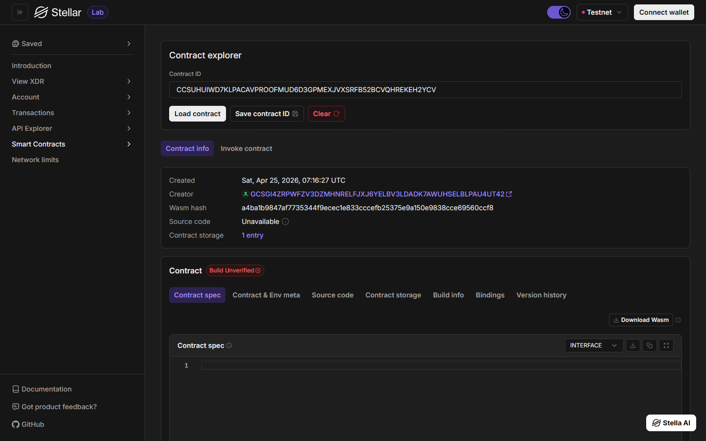
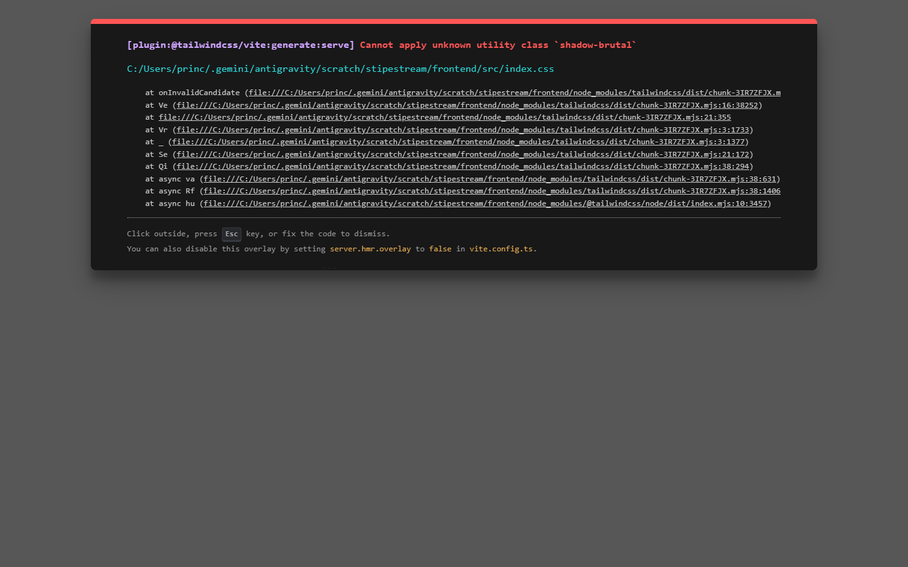

# StipeStream

**One-Line Description:** An automated, time-locked Soroban smart contract that guarantees on-time monthly stipend distributions for university scholars.

## What is StipeStream?
StipeStream is a decentralized aid disbursement protocol built on the Stellar Soroban network. It empowers NGOs, alumni funds, and educational institutions to lock stipends in a smart contract, allowing students to claim their allowance trustlessly and automatically on a strict schedule.

## The Problem it Solves
**Problem:** A low-income university scholar in Metro Manila (and globally) faces food insecurity and risks dropping out because their monthly living allowance from a local NGO is chronically delayed by bureaucratic accounting bottlenecks. The cost of friction includes severe cash flow disruptions leading to skipped meals, late rent penalties, or taking out high-interest short-term loans.

## How it Works
**Solution:** An NGO or alumni fund locks the entire semester's stipend in a Soroban smart contract at the start of the term. This empowers the student to trustlessly withdraw exactly one month's allowance (in USDC) every 30 days without waiting for any human approval. 

1. **Initialization:** The funder (NGO) initializes the contract with the student's address and the agreed stipend amount.
2. **Funding:** The funder deposits a large sum (e.g., for a full semester) into the contract's vault.
3. **Claiming:** The student connects their wallet (e.g., Freighter) and withdraws one month's allowance exactly every 30 days. The time-lock strictly prevents early withdrawals.

## Smart Contract Details

**Contract ID:** `CCSUHUIWD7KLPACAVPROOFMUD6D3GPMEXJVXSRFB52BCVQHREKEH2YCV`

**Deployed Smart Contract Link:** 
[View on Stellar Lab (Testnet)](https://lab.stellar.org/r/testnet/contract/CCSUHUIWD7KLPACAVPROOFMUD6D3GPMEXJVXSRFB52BCVQHREKEH2YCV)

*(Recommended) Screenshot of the deployed contract:*



## Web Application Interface
Here is the neo-brutalist inspired UI for StipeStream, designed for a frictionless user experience:

### Home Dashboard


### Secure Stipend Entry


### Transaction Ledger


## Timeline
Can be easily built, customized, and demoed via a simple web frontend within a 48-hour bootcamp.

## Stellar Features Used
* Soroban Smart Contracts (Time-locked conditions)
* USDC Transfers

## Vision and Purpose
To automate social aid and educational grants, ensuring funds reach students exactly when they need them without heavy administrative overhead or delays. 

## Prerequisites
* Rust toolchain (`rustup target add wasm32-unknown-unknown`)
* Soroban CLI (`cargo install --locked soroban-cli`)

## Quickstart

**1. How to Build**
```bash
soroban contract build
```

**2. How to Test**
```bash
cargo test
```

**3. How to Deploy to Testnet**
```bash
soroban contract deploy \
  --wasm target/wasm32-unknown-unknown/release/stipestream.wasm \
  --source <YOUR_FUNDED_SECRET_KEY> \
  --network testnet
```

**4. CLI Invocation (Simulate MVP Function)**
*(Assuming enough time has passed since initialization)*
```bash
soroban contract invoke \
  --id CCSUHUIWD7KLPACAVPROOFMUD6D3GPMEXJVXSRFB52BCVQHREKEH2YCV \
  --source <STUDENT_SECRET_KEY> \
  --network testnet \
  -- \
  claim
```

## License
MIT License
