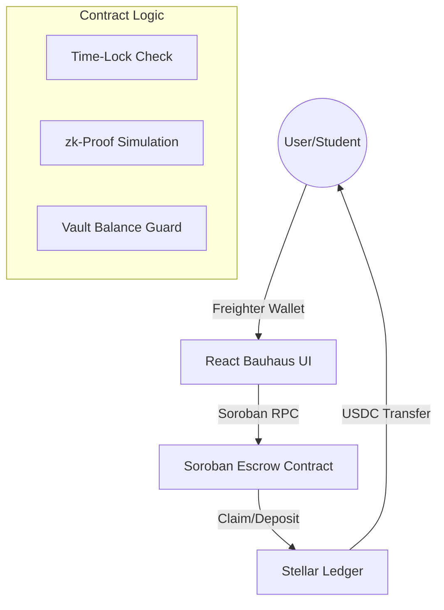

# StipeStream

**One-Line Description:** An automated, time-locked Soroban smart contract that guarantees on-time monthly stipend distributions for university scholars with a premium Bauhaus-inspired interface.


## The Friction: Why StipeStream?
**The Scenario:** Maria is a senior computer science student at a university in Metro Manila. Her monthly living allowance from a local scholarship NGO is her only way to pay for her daily commute and meals. When the NGO’s accounting department faces a "bureaucratic bottleneck," Maria’s funds are delayed by two weeks. 

This delay costs her **₱750 in late rent penalties** and forces her to **skip at least one meal a day** to stretch her remaining cash. With StipeStream, the NGO locks the funds once at the start of the semester, and Maria withdraws her ₱5,000 allowance exactly every 30 days—no administrative delays, no late fees, no skipped meals.

---

## What is StipeStream?
StipeStream is a decentralized aid disbursement protocol built on the **Stellar Soroban** network. It empowers NGOs, alumni funds, and educational institutions to lock stipends in a smart contract, allowing students to claim their allowance trustlessly and automatically on a strict schedule.

---

## Why Stellar?
StipeStream leverages the Stellar network to solve the "last mile" of aid distribution:

| Feature | Use Case in StipeStream |
| :--- | :--- |
| **Soroban Smart Contracts** | Enforces the 30-day time-lock and automatic payout logic trustlessly. |
| **USDC (Stellar Asset)** | Provides a stable store of value for scholars, avoiding crypto volatility. |
| **Freighter Wallet** | Handles secure transaction signing for deposits and claims with zero friction. |
| **Network Ledger** | Provides absolute transparency for NGO treasury audits and public trust. |

---

## Key Features

### 1. Smart Contract Time-Locks
Funds are locked in a Soroban escrow. Students can only withdraw their `payout_amount` after a 30-day interval has passed since their last claim. Human intervention is removed, eliminating administrative delays.

### 2. Risk-Free Demo Mode
Explore the entire platform without spending real XLM or having a connected wallet. 
- **Isolated Storage:** Demo actions use separate `localStorage` keys, ensuring your real on-chain data remains untouched.
- **Simulated Transactions:** `executeRealSorobanTx` is bypassed, replacing wallet prompts with mock transaction hashes and realistic network delays.
- **Pre-loaded State:** Instantly populates the dashboard with $12,500 TVL and 15 scholars to show the protocol in an "active" state.
- **Safety First:** A mandatory disclaimer modal ensures users know their real funds are never at risk.

### 3. Persistent Dark Mode
Full support for user-preferred theming. StipeStream remembers your choice between Light and Dark mode, using a premium charcoal palette that preserves the Bauhaus primary colors' vibrancy while reducing eye strain.

### 4. Fully Responsive Engineering
The dashboard is engineered to be a mobile-first experience. 
- **Wrapping Headers:** Navigation and wallet controls wrap logically on small screens.
- **Stacked Layouts:** Complex dashboards transition from multi-column grids to intuitive vertical stacks.

---

## Target Users
- **NGOs / Funders:** Organizations requiring transparent, automated disbursement with zero overhead.
- **Scholars (Students):** High-need students relying on predictable, on-time living allowances.
- **Donors:** Individuals who want to see their impact in real-time through the **Impact NFT** visualization.

---

## Architecture



---

## Project Structure
```text
stipestream/
├── contracts/               # Soroban smart contracts
│   └── hello-world/         # Core disbursement logic
│       ├── src/lib.rs       # Rust implementation of escrow & time-locks
├── frontend/                # React Web Application
│   ├── src/
│   │   ├── App.tsx          # Main logic, Demo Mode, & Dashboard routing
│   │   └── index.css        # Bauhaus Design System & Dark Mode variants
│   ├── tailwind.config.js   # Custom Bauhaus design tokens
│   └── screenshot.cjs       # Puppeteer automation for documentation
└── README.md                # Detailed project documentation
```

---

## User Walkthrough
1. **Enter Demo Mode:** Toggle the Demo button in the top right to explore without real funds.
2. **Onboard Scholar:** In the Sponsor Dashboard, check 'Onboard new scholar' and deposit simulated USDC.
3. **Verify Identity:** In the Scholar Dashboard, click 'Verify Student ID' to simulate a zk-Proof KYC check.
4. **Claim Stipend:** Once the 30-day timer expires (or simulated in Demo), click 'Claim USDC' to trigger the distribution.

---

## Smart Contract Details

**Contract ID:** `CCSUHUIWD7KLPACAVPROOFMUD6D3GPMEXJVXSRFB52BCVQHREKEH2YCV`

- **Deployed Smart Contract:** [View on Stellar Lab (Testnet)](https://lab.stellar.org/r/testnet/contract/CCSUHUIWD7KLPACAVPROOFMUD6D3GPMEXJVXSRFB52BCVQHREKEH2YCV)
- **Deployment Transaction:** [View on Stellar Expert](https://stellar.expert/explorer/testnet/tx/67a18357ecf92708f61bd0132823395767bf4df8816802d8404e5f6592004bfd)

### On-Chain Verification
#### Deployment Transaction


#### Deployed Smart Contract


---

## Setup & Quickstart

### Prerequisites
* Rust toolchain (`wasm32-unknown-unknown`)
* Soroban CLI
* Node.js v18+
* Freighter Wallet Extension

### Detailed Setup
**1. Clone and Install**
```bash
git clone https://github.com/PrinceDale99/StripeSpend.git
cd StripeSpend/frontend
npm install
```

**2. Environment Variables**
Create a `.env` file in the `frontend` directory:
```env
VITE_CONTRACT_ID=CCSUHUIWD7KLPACAVPROOFMUD6D3GPMEXJVXSRFB52BCVQHREKEH2YCV
VITE_STELLAR_RPC_URL=https://soroban-testnet.stellar.org
VITE_NETWORK_PASSPHRASE="Test SDF Network ; September 2015"
```

**3. Run Locally**
```bash
npm run dev
```

### Detailed Deployment
```bash
# 1. Generate and fund a Testnet identity
soroban config identity generate deployer
soroban config identity fund deployer --network testnet

# 2. Build the contract
cd contracts/hello-world
soroban contract build

# 3. Deploy to Testnet
soroban contract deploy \
  --wasm target/wasm32-unknown-unknown/release/stipestream.wasm \
  --source deployer \
  --network testnet
```

---

## License
MIT License
